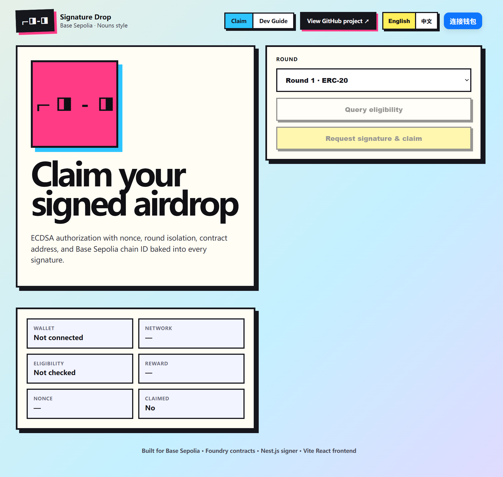

<div align="center">

# Signature Drop

**ECDSA signature-gated airdrop demo for Base Sepolia**

<p>
  <a href="./README.md"></a>
  <a href="./README.zh.md"></a>
</p>

<p>
  <a href="#overview"></a>
  <a href="#quick-start"></a>
  <a href="#deployment"></a>
  <a href="./guild.en.md"></a>
  <a href="./contracts/README.md"></a>
</p>

<p>
  
  
  
  
  
  
</p>

</div>

---

<p align="center">
  
</p>

## Overview

Signature Drop is a full-stack Web3 demo that lets users claim ERC20 or ERC721 rewards only after receiving an authorization signature from a backend signer. The current repository includes the Foundry contracts, Nest.js signing API, React claim UI, Render backend deployment configuration, Vercel frontend deployment configuration, and an in-app bilingual development guide.

| Layer | Path | Stack | Responsibility |
| --- | --- | --- | --- |
| Smart contracts | `contracts/` | Foundry, Solidity 0.8.24, OpenZeppelin | Deploy `SignatureAirdrop`, demo ERC20, demo ERC721; configure rounds; verify claim signatures |
| Backend API | `backend/` | Nest.js 11, TypeScript, ethers v6 | Load/persist whitelist entries, check eligibility/claimed state, sign eligible claims |
| Frontend | `frontend/` | Vite 7, React 19, wagmi 2, RainbowKit 2 | Wallet connection, round selection, self-join whitelist, signature request, on-chain claim |
| Deployment | root configs | Render + Vercel | Render blueprint for backend, Vercel config for frontend monorepo deployment |

## Application routes

The Vite app is a single-page app with hash routing:

- `/#claim` or `/` — claim flow.
- `/#guide` — bilingual development/deployment guide rendered from `guild.md` and `guild.en.md`.

The in-app language switch persists the selected language in `localStorage` and swaps the guide between Chinese and English.

## Security model

The backend signs exactly the payload that the contract verifies:

```solidity
keccak256(abi.encodePacked(
  recipient,
  round,
  amountOrTokenId,
  nonce,
  address(this),
  block.chainid
))
```

This binds every authorization to:

| Field | Replay protection |
| --- | --- |
| `recipient` | Prevents one wallet from using another wallet's signature |
| `round` | Prevents cross-round reuse |
| `amountOrTokenId` | Binds ERC20 amount or ERC721 claim payload |
| `nonce` | Adds per-entry uniqueness from the whitelist service |
| `address(this)` | Prevents cross-contract replay |
| `block.chainid` | Prevents cross-chain replay |

On-chain claim state is tracked by `claimed[round][tokenType][user]`, so the same user can claim at most once for each round/token type pair.

## Repository structure

```text
signature-airdrop/
├── README.md
├── README.zh.md              # Chinese GitHub README
├── guild.md                  # Chinese development/deployment guide
├── guild.en.md               # English guide used by the in-app guide
├── render.yaml               # Render backend blueprint
├── vercel.json               # Vercel monorepo frontend config
├── docs/assets/
│   └── signature-drop-ui.png
├── contracts/
│   ├── foundry.toml
│   ├── src/Airdrop.sol
│   ├── src/AirdropToken.sol
│   ├── src/AirdropNFT.sol
│   ├── script/Deploy.s.sol
│   └── test/Airdrop.t.sol
├── backend/
│   ├── src/main.ts
│   ├── src/sign/
│   ├── src/whitelist/
│   └── whitelist.json
└── frontend/
    ├── src/App.tsx
    ├── src/components/ClaimPanel.tsx
    ├── src/components/DevelopmentGuide.tsx
    ├── src/config/Web3Provider.tsx
    └── src/hooks/useAirdrop.ts
```

## Quick start

### Prerequisites

- Node.js 22 and npm.
- Foundry (`forge`, `cast`).
- Base Sepolia ETH for deployment and claim testing.
- Etherscan API V2 key if contract verification is required.
- WalletConnect Project ID for production RainbowKit usage.

### Environment files

Copy the example files and keep real values out of Git:

```bash
cp contracts/.env.example contracts/.env
cp backend/.env.example backend/.env
cp frontend/.env.local.example frontend/.env.local
```

| File | Key variables |
| --- | --- |
| `contracts/.env` | `BASE_SEPOLIA_RPC_URL`, `PRIVATE_KEY`, `SIGNER_ADDRESS`, `BASESCAN_API_KEY` |
| `backend/.env` | `PORT`, `CHAIN_ID`, `RPC_URL`, `AIRDROP_CONTRACT_ADDRESS`, `SIGNER_PRIVATE_KEY`, `WHITELIST_PATH`, `CORS_ORIGIN` |
| `frontend/.env.local` | `VITE_API_BASE_URL`, `VITE_AIRDROP_CONTRACT_ADDRESS`, `VITE_WALLETCONNECT_PROJECT_ID` |

Never put `PRIVATE_KEY` or `SIGNER_PRIVATE_KEY` into frontend env variables.

## Contracts

Install Foundry dependencies after cloning because `contracts/lib/` is ignored:

```bash
cd contracts
forge install foundry-rs/forge-std --no-git
forge install OpenZeppelin/openzeppelin-contracts --no-git
```

Run tests:

```bash
cd contracts
forge test -vv
```

Deploy to Base Sepolia:

```bash
cd contracts
set -a
source .env
set +a

forge script script/Deploy.s.sol:Deploy \
  --rpc-url base_sepolia \
  --broadcast \
  -vvvv
```

Deploy and verify with Etherscan API V2:

```bash
forge script script/Deploy.s.sol:Deploy \
  --rpc-url base_sepolia \
  --broadcast \
  --verify \
  --verifier etherscan \
  --verifier-url "https://api.etherscan.io/v2/api?chainid=84532" \
  --etherscan-api-key "$BASESCAN_API_KEY" \
  -vvvv
```

The deployment script prints:

```text
SIGNATURE_AIRDROP_ADDRESS=<deployed SignatureAirdrop>
AIRDROP_TOKEN_ADDRESS=<deployed ERC20 token>
AIRDROP_NFT_ADDRESS=<deployed ERC721 token>
```

Synchronize at least `SIGNATURE_AIRDROP_ADDRESS` into:

- `backend/.env`: `AIRDROP_CONTRACT_ADDRESS=<SIGNATURE_AIRDROP_ADDRESS>`
- `frontend/.env.local`: `VITE_AIRDROP_CONTRACT_ADDRESS=<SIGNATURE_AIRDROP_ADDRESS>`

## Backend

```bash
cd backend
npm ci
npm run dev
```

Default local API base URL: `http://localhost:4000/api`.

| Method | Path | Purpose |
| --- | --- | --- |
| `GET` | `/api/health` | Health, signer address, chain ID, configured airdrop contract |
| `GET` | `/api/eligibility?address=0x...&round=1` | Eligibility and claimed status for one wallet/round |
| `POST` | `/api/sign` | Return a claim signature for an eligible, unclaimed address |
| `GET` | `/api/whitelist` | List whitelist entries, optional `?round=1` |
| `GET` | `/api/whitelist/:address` | List entries for one address, optional `?round=1` |
| `POST` | `/api/whitelist` | Add/update an address for demo/admin use |
| `POST` | `/api/whitelist/join` | Demo self-join endpoint used by the frontend |
| `DELETE` | `/api/whitelist` | Remove an address from a round |

The whitelist is persisted in `backend/whitelist.json`. Current data contains six demo addresses for Round 1 ERC20 and Round 2 ERC721.

## Frontend

```bash
cd frontend
npm ci
npm run dev
```

Default local frontend URL: `http://localhost:5173`.

The claim UI starts on Round 2 by default, supports Round 1 ERC20 and Round 2 ERC721, and shows a self-join button when the connected wallet is not eligible.

## Deployment

### Render backend

`render.yaml` defines a Node web service:

| Setting | Value |
| --- | --- |
| Service | `signature-airdrop-backend` |
| Root directory | `backend` |
| Region | `oregon` |
| Build command | `npm ci && npm run build` |
| Start command | `npm run start` |
| Health check | `/api/health` |
| Node version | `22` |

Set these sensitive Render variables manually because they are marked `sync: false`:

- `AIRDROP_CONTRACT_ADDRESS`
- `SIGNER_PRIVATE_KEY`

`CORS_ORIGIN` must include the Vercel production/preview origins that should be allowed to call the API.

### Vercel frontend

Root `vercel.json` is the source of truth for the monorepo frontend deployment:

```json
{
  "framework": "vite",
  "installCommand": "cd frontend && npm ci",
  "buildCommand": "cd frontend && npm run build",
  "outputDirectory": "frontend/dist"
}
```

Configure Vercel env variables:

```text
VITE_API_BASE_URL=https://<render-service-domain>/api
VITE_AIRDROP_CONTRACT_ADDRESS=<SIGNATURE_AIRDROP_ADDRESS>
VITE_WALLETCONNECT_PROJECT_ID=<walletconnect-project-id>
```

## Verification

Fresh local verification from this documentation sync:

| Area | Command | Result |
| --- | --- | --- |
| Contracts | `cd contracts && forge test -vv` | Passed: 7 tests, 0 failed |
| Backend | `cd backend && npm run build` | Passed TypeScript compilation |
| Frontend | `cd frontend && npm run build` | Passed Vite production build; Rollup emitted dependency annotation/chunk-size warnings |

## More documentation

- Chinese README: [`README.zh.md`](./README.zh.md)
- Chinese guide: [`guild.md`](./guild.md)
- English guide: [`guild.en.md`](./guild.en.md)
- Contract-specific guide: [`contracts/README.md`](./contracts/README.md)
